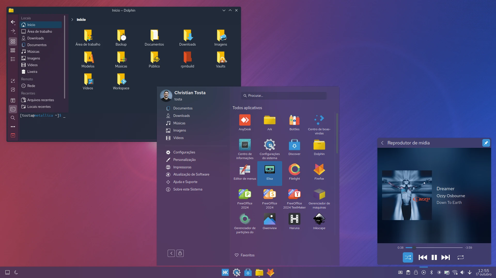

# Vinyl Theme for KDE Plasma 6

This theme is a collection of libraries and artwork, some was initially forks and ports of various other 
pieces of code and graphics work for KDE Plasma 6:

>[!NOTE]
>This software is on development for KDE Plasma version 6 (and related to Qt6) and can't run on previous versions of Plasma.



- [x] Colors: [ekaaty/vinyl-theme](https://github.com/ekaaty/vinyl-theme/tree/main/colors/)
- [x] Cursors: [cz-Aviator](https://github.com/ekaaty/vinyl-theme/tree/main/cursors/)
- [x] Firefox theme: [ekaaty/vinyl-theme](https://github.com/ekaaty/vinyl-theme/tree/main/mozilla/)
- [x] Icons: [ekaaty/vinyl-theme](https://github.com/ekaaty/vinyl-theme/tree/main/icons/)
- [x] KSplash: [ekaaty/vinyl-theme](https://github.com/ekaaty/vinyl-theme/tree/main/splash/)
- [x] Kdecoration: [ekaaty/vinyl-theme](https://github.com/ekaaty/vinyl-theme/tree/main/kdecoration/)
- [x] Konsole: [ekaaty/vinyl-theme](https://github.com/ekaaty/vinyl-theme/tree/main/konsole/)
- [x] Kstyle: [ekaaty/vinyl-theme](https://github.com/ekaaty/vinyl-theme/tree/main/kstyle/)
- [x] Plasma style: [ekaaty/vinyl-theme](https://github.com/ekaaty/vinyl-theme/tree/main/desktoptheme/)
- [x] SDDM theme: [kde/sddm-theme](https://invent.kde.org/plasma/plasma-desktop/-/tree/master/sddm-theme)
- [x] Wallpapers: [ekaaty/vinyl-theme](https://github.com/ekaaty/vinyl-theme/tree/main/wallpapers/)
- [ ] Global theme: [ekaaty/vinyl-theme](https://github.com/ekaaty/vinyl-theme/tree/main/lookandfeel/)
- [ ] GTK themes: planned
- [ ] Plymounth theme: planned
- [ ] Grub2 theme: planned

See [AUTHORS.md](AUTHORS.md) file and sub-project folders for more info.

## Installing pre-built binaries

### 1\. Fedora/Nobara

You can install Vinyl nativelly on [Fedora](https://fedoraproject.org/kde/), [Nobara](https://nobaraproject.org) 
and derivated distros by enabling the [ekaaty/kde-extras](https://copr.fedorainfracloud.org/coprs/ekaaty/kde-extras)
COPR repository. To enable this repository and install packages run:

```
sudo dnf copr enable ekaaty/kde-extras
sudo dnf upgrade
sudo dnf install vinyl-theme
```
### 2\. Kinoite/Bazzite

If you are running Fedora [Kinoite](https://fedoraproject.org/atomic-desktops/kinoite/) or 
[Bazzite](https://bazzite.gg/), also you can install Vinyl from the 
[ekaaty/kde-extras](https://copr.fedorainfracloud.org/coprs/ekaaty/kde-extras) COPR repository. 
To enable this repository and install packages run:

```
sudo ostree remote add ekaaty-kde-extras \
  https://download.copr.fedorainfracloud.org/results/ekaaty/kde-extras/fedora-$releasever-$basearch/
sudo rpm-ostree upgrade
sudo rpm-ostree install --apply-live vinyl-theme
```

### 3\. Arch/Manjaro or CachyOS/Garuda and derivatives

The package is available to be installed from the Arch Linux AUR.

https://aur.archlinux.org/packages/vinyl-git

You can use your favorite Arch AUR helper to install it.
Example:

```shell
yay -S vinyl-git
```

## Building from source (manual build)

### Build Dependencies

You must install at least the following dependencies on your distibution to
build this theme:

``cmake``
``cmake(KDecoration3)``
``cmake(KF6ConfigWidgets)``
``cmake(KF6Config)``
``cmake(KF6CoreAddons)``
``cmake(KF6Crash)``
``cmake(KF6DocTools)``
``cmake(KF6FrameworkIntegration)``
``cmake(KF6GlobalAccel)``
``cmake(KF6GuiAddons)``
``cmake(KF6I18n)``
``cmake(KF6IconThemes)``
``cmake(KF6KCMUtils)``
``cmake(KF6KIO)``
``cmake(KF6Notifications)``
``cmake(KF6Package)``
``cmake(KF6WindowSystem)``
``cmake(KF6KirigamiPlatform)``
``cmake(KWayland)``
``cmake(KWin)``
``cmake(Plasma)``
``cmake(Qt6Core)``
``cmake(Qt6Core5Compat)``
``cmake(Qt6DBus)``
``cmake(Qt6Gui)``
``cmake(Qt6UiTools)``
``pkgconfig(epoxy)``
``extra-cmake-modules >= 6.13.0``
``gcc-c++``
``inkscape``
``xcursorgen``
``unzip``

#### 1\. Fedora/Nobara or Kinoite/Bazzite and derivatives

> [!NOTE]
> Only systems based on Fedora 41+ is supported.

Run the following command to install the dependencies:

```shell
dnf install 'cmake' \
  'cmake(KDecoration3)' 'cmake(KF6ConfigWidgets)' 'cmake(KF6Config)' 'cmake(KF6CoreAddons)' \
  'cmake(KF6Crash)' 'cmake(KF6DocTools)' 'cmake(KF6FrameworkIntegration)' \
  'cmake(KF6GlobalAccel)' 'cmake(KF6GuiAddons)' 'cmake(KF6I18n)' 'cmake(KF6IconThemes)' \
  'cmake(KF6KCMUtils)' 'cmake(KF6KIO)' 'cmake(KF6Notifications)' 'cmake(KF6Package)' \
  'cmake(KF6WindowSystem)' 'cmake(KF6KirigamiPlatform)' 'cmake(KWayland)' 'cmake(KWin)' \
  'cmake(Plasma)' 'cmake(Qt6Core)' 'cmake(Qt6Core5Compat)' 'cmake(Qt6DBus)' 'cmake(Qt6Gui)' \
  'cmake(Qt6UiTools)' 'pkgconfig(epoxy)' 'extra-cmake-modules' 'gcc-c++' \
  'git' 'inkscape' 'xcursorgen' 'unzip'
```

#### 2\. OpenSUSE Tumbleweed

Run the following command to install the dependencies:

```shell
sudo zypper in --allow-downgrade --no-recommends 'cmake' \
  'cmake(KDecoration3)' 'cmake(KF6ConfigWidgets)' 'cmake(KF6Config)' 'cmake(KF6CoreAddons)' \
  'cmake(KF6Crash)' 'cmake(KF6DocTools)' 'cmake(KF6FrameworkIntegration)' \
  'cmake(KF6GlobalAccel)' 'cmake(KF6GuiAddons)' 'cmake(KF6I18n)' 'cmake(KF6IconThemes)' \
  'cmake(KF6KCMUtils)' 'cmake(KF6KIO)' 'cmake(KF6Notifications)' 'cmake(KF6Package)' \
  'cmake(KF6WindowSystem)' 'cmake(KF6KirigamiPlatform)' 'cmake(KWayland)' 'cmake(KWin)' \
  'cmake(Plasma)' 'cmake(Qt6Core)' 'cmake(Qt6Core5Compat)' 'cmake(Qt6DBus)' 'cmake(Qt6Gui)' \
  'cmake(Qt6UiTools)' 'pkgconfig(epoxy)'' 'extra-cmake-modules' 'gcc-c++' \
  'git' 'inkscape' 'xcursorgen' 'unzip'
```

#### 3\. Debian/Kubuntu or Neon/Tuxedo and derivatives

>[!IMPORTANT]
>Kubuntu 24.04 LTS doesn't support KDE Plasma 6 yet. Otherwise it's available on Kubuntu 24.10+
> and current versions of Debian (Trixie), KDE Neon and Tuxedo OS.

If you're running Plasma 6 on one of supported distributions, run the following command to install
the dependencies:

```shell
sudo apt install 'cmake' \
  'libkdecorations3-dev' 'libkf6configwidgets-dev' 'libkf6config-dev' 'libkf6coreaddons-dev' \
  'libkf6doctools-dev' 'libkf6style-dev' 'libkf6globalaccel-dev' 'libkf6guiaddons-dev' \
  'libkf6i18n-dev' 'libkf6iconthemes-dev' 'libkf6kcmutils-dev' 'libkf6kio-dev' \
  'libkf6notifications-dev' 'libkf6package-dev' 'libkf6windowsystem-dev' 'libkirigami-dev' \
  'kirigami2-dev' 'kwayland-dev' 'kwin-dev' 'libplasma-dev' 'qt6-base-dev' 'qt6-5compat-dev' \
  'libqt6gui6' 'libqt6uitools6' 'libepoxy-dev' 'build-essential' 'git' 'inkscape' \
  'x11-apps' 'unzip'
```

#### 4\. Arch/Manjaro or CachyOS/Garuda and derivatives

Run the following command to install the dependencies:

```shell
sudo pacman -Sy --needed 'cmake' \
  'base-devel' 'git' 'cmake' 'extra-cmake-modules' 'git' 'kdecoration' 'qt6-declarative' \
  'kcoreaddons' 'kcmutils' 'kcolorscheme' 'kconfig' 'kguiaddons' 'kiconthemes' 'kwindowsystem' \
  'kdoctools' 'kpackage' 'frameworkintegration' 'inkscape' 'xorg-xcursorgen' 'gcc' 'unzip'
```

### Building the source

To build the code, do the following:

```shell
git clone https://github.com/ekaaty/vinyl-theme
export NPROCS=$(grep -c proc /proc/cpuinfo)

cd vinyl-theme
cmake -S . -B build
cmake --build build -j${NPROCS} --verbose
```

To build only application style and decoration, use:

```shell
cd vinyl-theme
cmake -DWITH_MINIMAL=ON -S . -B build
cmake --build build -j${NPROCS} --verbose
```

### Installing the built files

And, finally, to install the files execute the following (will install it to the DESTDIR/PREFIX
directory):

```shell
# On non-Fedora systems you can change PREFIX variable (eg. PREFIX=/usr/local) to
# match your KDE instalation
export PREFIX=$([ $(id -u) -eq 0 ] && echo /usr || echo ~/.local)

cd vinyl-theme
cmake --install build --prefix ${PREFIX}
```
